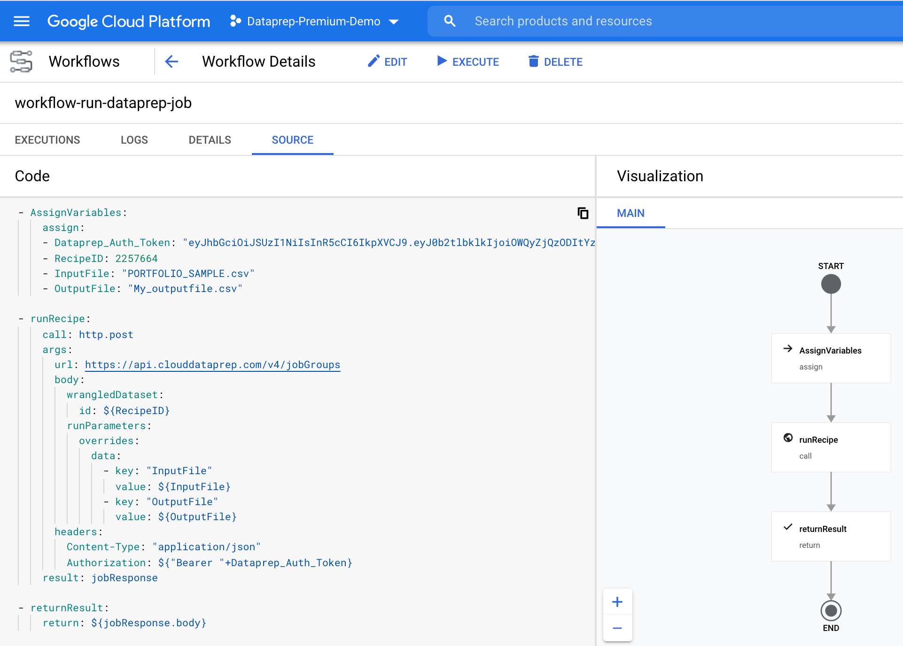

# Run a Cloud Dataprep job from a Google Workflow

Example of [Google Workflow](https://cloud.google.com/workflows) YAML code to run a [Dataprep](https://cloud.google.com/dataprep) job with input and output parameters.

- [Code example](https://github.com/victorcouste/google-workflow-dataprep/blob/main/workflow-single-dataprep-job.yaml) to run a single Dataprep job
- [Google Workflow documentation](https://cloud.google.com/workflows/docs)
- [Cloud Dataprep API documentation](https://api.trifacta.com/dataprep-premium/index.html)

